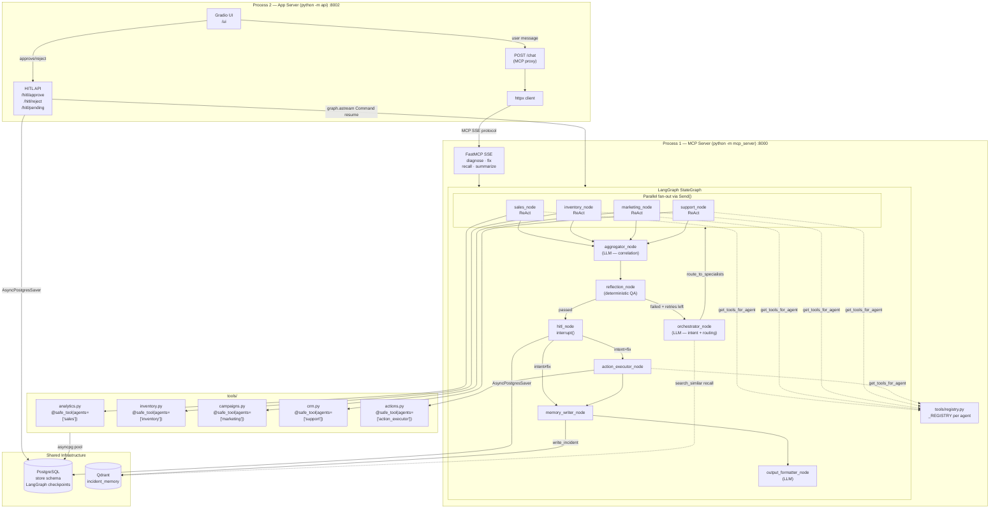

**Key points the diagram shows:**

- **Two separate OS processes** — the App Server never touches graph code directly except for HITL resume, which works because both processes share `AsyncPostgresSaver` on PostgreSQL.
- **Tool registry** — all 4 specialists and the action executor call `get_tools_for_agent()` at runtime; no hardcoded imports.
- **Reflection loop** — feeds back to the orchestrator on failure, advances to HITL on pass.
- **HITL cross-process** — the App Server's HITL API calls `graph.astream(Command(resume=...))` directly, bypassing the MCP Server, because the checkpoint lives in PostgreSQL.